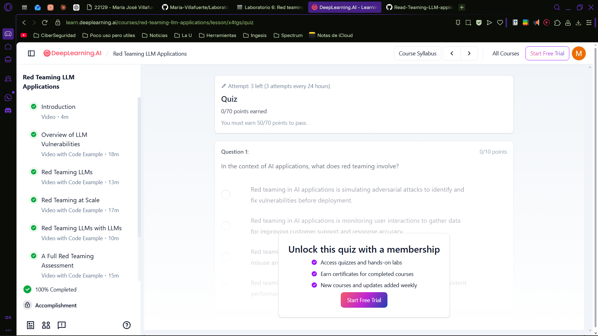

# Red Teaming LLM Applications

Laboratorio basado en el curso **Red Teaming LLM Applications** de [DeepLearning.AI](https://www.deeplearning.ai/).

## Descripcion

Este laboratorio cubre tecnicas de red teaming aplicadas a modelos de lenguaje (LLMs), explorando vulnerabilidades comunes como sesgo, divulgacion de informacion sensible, interrupcion de servicio y alucinaciones.

## Contenido

| Notebook | Tema |
|---|---|
| `L1_Overview_of_LLM_vulnerabilities.ipynb` | Vision general de vulnerabilidades en LLMs |
| `L2_Red_teaming_LLMs.ipynb` | Red teaming a LLMs |
| `L3_Red_teaming_at_scale.ipynb` | Red teaming a escala |
| `L4_Red_teaming_LLMs_with_LLMs.ipynb` | Red teaming con LLMs |
| `L5_A_full_red_teaming_assessment.ipynb` | Evaluacion completa de red teaming |

## Evidencia de completacion

